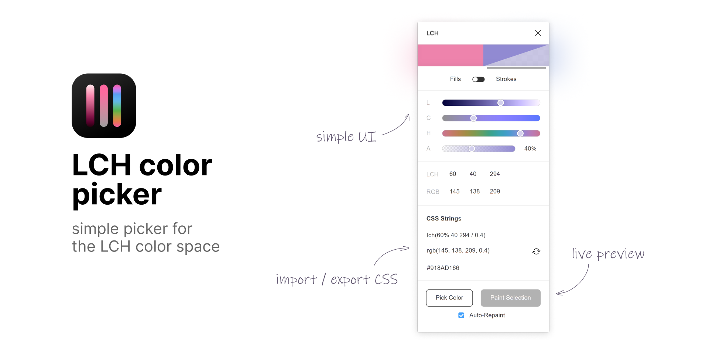

# Figma LCH plugin

A simple color picker plugin for Figma that utilizes LCH color space. See the [page](https://www.figma.com/community/plugin/969496279507778512/LCH) in Figma Community.

## Features
- Pick color by adjusting lightness, chroma, hue and alpha levels;
- Use it in your designs;
- Export it to CSS `lch()` notation (see [CSS Color Spec 4](https://www.w3.org/TR/css-color-4/#specifying-lab-lch)) or the closest `rgb()` alternative

## Acknowledgements
The plugin is heavily based on [Lea Verou](https://lea.verou.me/)'s picker available at [css.land/lch/](https://css.land/lch/). Conversion logic is by [Chris Lilley](https://svgees.us/).